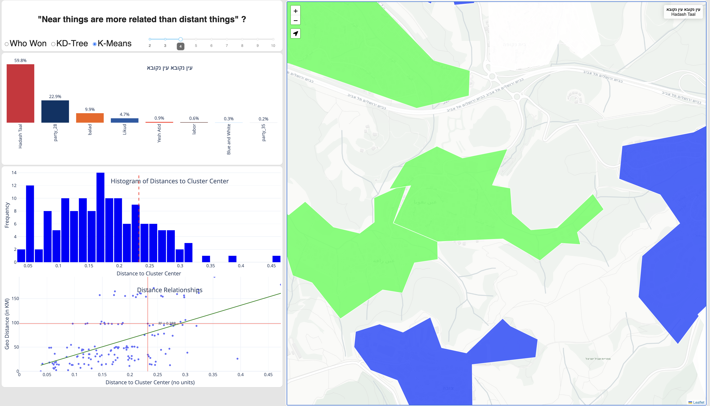

# 🗺️ Near things are more related than distant things?

Geo-Dashboard: Examining Attribute and Geographic Similarities

This project explores the correlation between geographic proximity and attribute similarity using K-D Trees and K-Means clustering, focusing on voting trends in Israel. It’s part of a series of articles about building geo-dashboards using Dash-Plotly and Dash-Leaflet. I wanted to challenge the famous “First Law of Geography” by examining if near things are more related than distant things, in terms of voting patterns across different statistical areas.

Key Features:
	•	Attribute Similarity Analysis: Using K-D Trees and K-Means clustering, this dashboard explores the Euclidean distance between statistical areas based on their voting patterns.
	•	Scientific Exploration: Investigating the correlation between geographic distance and attribute similarity (such as election votes) to understand if proximity leads to similar socio-economic or political patterns.
	•	Dynamic Dashboard: The dashboard allows users to interactively explore the geographical and attribute-based similarity of neighborhoods, and tests how similar statistical areas can be to one another, irrespective of geographic distance.
	•	Interactive Live Maps: Built with Dash-Plotly and Dash-Leaflet, this project creates a live interactive experience to explore the data visually.

Potential Applications:
	•	Apply socio-economic policies to similar neighborhoods.
	•	Examine the relationship between neighborhood characteristics and service availability.
	•	Identify patterns in crime rates, service requests (311 complaints), and more.
	•	Find areas with similar attributes for business expansion or relocation.

Techniques Used:
	•	K-D Trees: Used for efficient calculation of Euclidean distances between neighborhoods based on various attributes.
	•	K-Means Clustering: Used to group neighborhoods based on similar voting patterns.
	•	Dash-Plotly & Dash-Leaflet: Utilized to create dynamic, interactive maps for data exploration.

Requirements (to be detailed)

- Python 3.x
- Dash
- Dash-leaflet
- Plotly
- Pandas
- Scikit-learn (for KDTree)
- GeoPandas (optional, for additional geospatial data processing)

Installation (to be detailed)

## Blog post (work in progress)

# Near things are more related than distant things?

This post is the second in a series of geo-dashboard articles. The first one I wrote was a general crash course on geo-dashboards: **10 Steps to Build a Geo-Dashboard with Dash-Plotly and Dash-Leaflet Maps.** As I mentioned in the previous post, I love building geographic maps with Dash-Plotly because it allows me to quickly create and deploy somewhat complex interactive mapping user experiences and prototype my ideas in my favorite programming language, Python, while achieving React-like qualities.

In this post, I decided to take a more scientific approach and challenge the famous “First Law of Geography”: “Near things are more related than distant things” (Waldo Tobler).

In this dashboard, I chose to examine the correlation between physical geographic distance and “attribute distance.” While the results don’t provide a clear academic conclusion, they do offer some intuition for answering the question: “Are near things more related than distant things?”

For this analysis, I focused on statistical areas and sought to identify the *n* most similar statistical areas in terms of attributes. The topic I chose to explore is election votes in Israel—not just the winner in each statistical area, but the entire voting distribution within that area.

In this way, I could determine which neighborhood(s) are most similar to mine and whether they are geographically close. However, applying a similarity index can go far beyond an election dashboard. We could analyze many other socio-economic factors or combinations of attributes, such as education, income, employment-rate, social-economic indicators, crime rates, 311 service calls, environmental qualities, or weather conditions. Additionally, examining similarity across multiple features could have practical applications, such as:

•	Apply a proven socio-economic policy from one neighborhood to others with similar attributes.
•	Examine the correlation between the lack of amenities and neighborhoods with similar characteristics.
•	Open a new business in neighborhoods similar to those where business ventures have yielded successful revenues.
•	Identify geographic/attribute patterns in areas that have experienced specific crimes or received specific 311 complaints.
•	Looking for a place to move? Examine neighborhoods that meet similar criteria to your reference area.

Let’s return to the scientific side of what I did in this dashboard — challenging the first law of geography. To do this, I applied two very different techniques:
1.	Examining attribute similarity using a K-D Tree, an efficient geographical algorithm for measuring Euclidean distance.
2.	Applying K-Means clustering to the attributes of the features, a technique that groups features around a set number of cluster centers.

I used the results of Israel’s elections and aggregated them into statistical areas. The central question I sought to answer was: Are attribute similarity distances correlated with geographic distances?

Now, I will dive into the scientific and statistical aspects of my work, and afterwards, I’ll explain the techniques I used to build this dashboard.

**Scientific/Statistical Techniques Explained:**

**K-D Trees**

A K-D Tree is an efficient way to compute Euclidean distances between geographic or attribute data points (think of Pythagoras’ theorem: √(x₁² + x₂²)). The K-D Tree works by partitioning points in a multidimensional space. In practice, it allows for fast distance calculations between large sets of points, making it ideal for on-the-fly computations (up to a certain limit without applying other efficiency techniques).

Using a K-D Tree, I could select a specific statistical area (or neighborhood) and treat it as the “center,” then calculate the relative distance to all other statistical areas.

For example, let’s say I live in central Tel Aviv, where 39% voted for “Yesh Atid,” 16% for “Meretz,” and 15% for “Labor,” and so on. I could then look at all other statistical areas in Israel and find those with the most similar voting patterns, regardless of geographic distance. This would allow me to identify neighborhoods in Haifa, for instance, that share similar voting attributes.

**K-Means**

K-Means is a clustering algorithm used in machine learning and data analysis to group data points into **K** clusters. The algorithm works by iteratively finding natural cluster centers. It begins with random points, finds the closest data points to them, and then re-adjusts the center points based on the emerging clusters.

**Combining K-D Trees and K-Means**

In this exercise, I used K-Means to identify natural clusters with similar voting patterns. Since each data point is assigned a cluster index (from 0 to K), I performed the following steps:

1.	Take the row nearest to the K-Means center (for a specific cluster) and flag it as the cluster center.

2.	Compare the remaining points in the cluster to this center and calculate the Euclidean distance between them.

To efficiently calculate the Euclidean distance in N-dimensional space, I used a K-D Tree, which allows for quick distance computations on the fly.

**Some Technical tips and challenges I encounter while building this dashboard.**

I really enjoy exploring Dash-Plotly (and dash-leaflet) because it’s a tool that allows me to elevate dashboards to an interactive, game-like experience and achieve things that would be difficult, if not impossible, in traditional BI tools like Tableau or Power BI. For example, if I wanted to run K-Means or K-D Trees on the fly in Power BI, I’d face numerous challenges. But with Dash-Plotly, I have the full power of Python at my fingertips. In this section, I’d like to share some technical tips and explain how I overcame some challenges during the dashboard-building process.

## Multiple Views/Scnearios Based on Different Configurations
One of the powerful features that sets Dash-Plotly apart from drag-and-drop BI applications is the ability to control the UI using code. In this dashboard, I dynamically show or hide UI elements based on the selected method—whether it’s K-Means, K-D Tree, or simply displaying voting results. Another important aspect is the ability to modify both the functionality and the content displayed on the map based on user selections.

Some tips to for tackeling multiple views and scenarios in the dashbaord:
1. 	To control the views (what is displayed and what is hidden), I borrowed a concept from JavaScript—toggling the visibility of Div elements. This is done by adding an output callback to one of the Div elements and modifying its style attribute.

Python'''
@ app.callback(Output("near_cluster_div", "style"), Output("kmeans_cluster_div", "style"), Output("kde_distance_barplot_div", "style"), Output("kmeans_frequencybarplot_div","style"), Input('raio_map_analysis', 'value'))
def controller(radioButton):
    if radioButton == 'who_won':
        return [{'display':'none'},{'display':'none'}, {'display':'none'}, {'display':'none'}]
    elif radioButton == 'kdtree':
        return [{'width': '50%', 'display':'block'}, {'display':'none'}, {'display':'block'}, {'display':'none'}]
    else:
        return [{'display':'none'}, {'width': '50%', 'display':'block'},{'display':'none'}, {'display':'block'}]

'''

- Multiple Scenarios in the app.
    - Hiding and showing the right div - returning empty divs
    - Working with multiple map-layers configurations based on the scenario
- Avoiding extensive runs by examining the state of the model.
    - Sateralizing a model
- working with two way callbacks, where the map controls the graph and the graph controls the map
- Using the Map layer is the source of data

Dash apps tend to become very long and messy, often resembling spaghetti code. To keep your code clean and maintainable, consider the following:
	1.	Refactor, Refactor, Refactor! Continuously improve and restructure your code.
	2.	Step Away and Reevaluate – If your code becomes too long and difficult to follow, take a break for a few days. When you return, review it with a bird’s-eye view and logically restructure it.
	3.	Use External Files for Configuration and Reusable Methods – If you have configuration variables or general-purpose methods that aren’t directly tied to your app’s logic, move them to separate files. Keep your functions short, clear, and well-structured, avoiding deep hierarchical complexity.
    4. .	Don’t hesitate to use GPT agents to restructure your code, add comments, write docstrings, and format your document properly. It’s a real time-saver!

In this post, I explored K-D Trees and K-Means as methods to examine attribute Euclidean distance and tested whether it’s related to geographic distances. The value of using K-D Trees, K-Means, or a combination of both lies in the ability to test similarity across multiple dimensions (i.e., the attribute dimensions). Based on a quick exploration of Israel, it appears there isn’t a strong correlation between geography and voting trends.

In addition to the scientific analysis, I aimed to showcase how I can apply efficient Python mathematical models “on the fly” to tens of thousands of rows of data with many features.

As with my previous posts (and future ones), I love finding ways to implement Dash-Plotly together with Dash-Leaflet, challenging these technologies and discovering creative solutions to overcome their limitations. I really enjoy creating live maps, and for me, Dash-Plotly + Dash-Leaflet is a great way to practice and refine my emerging Data Science skills. It’s “reactiveness”  also inspires me on my journey to becoming a geo-driven full-stack developer.

I believe attribute similarity has great potential and practical applications. I’d love to hear your ideas in the comments. The code for this project can be found in the repository.

