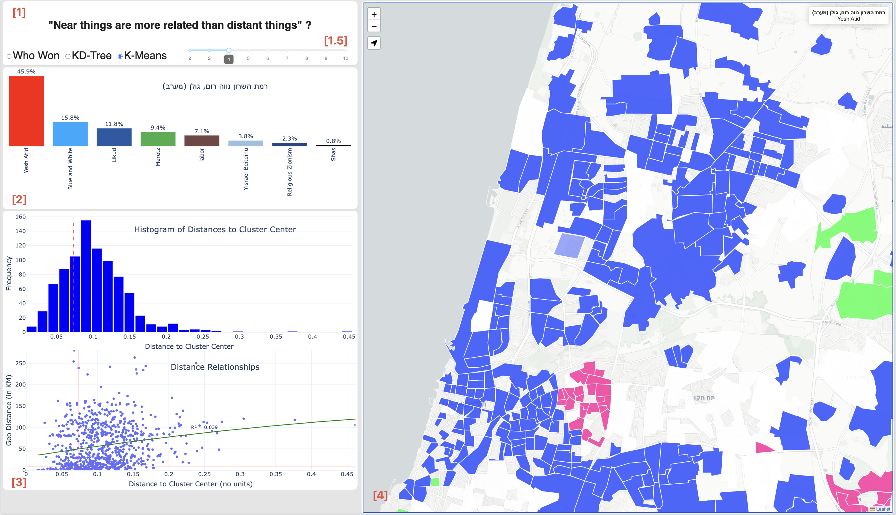

## Blog post (work in progress)

# Near things are more related than distant things? (Part 2)

This post is part of an on-going series of geo-dashboard articles. If you have no or some expierence in Dash-plotly or dash-leaflet I suggest you look at: **10 Steps to Build a Geo-Dashboard with Dash-Plotly and Dash-Leaflet Maps.** Anyhow I love building geographic maps with Dash-Plotly because it allows me to quickly create and deploy somewhat complex interactive mapping user experiences and prototype my ideas in my favorite programming language, Python, while achieving React-like (JavaScript React) qualities.

This post is a part 2 in a two part post, Where I  challenge the famous “First Law of Geography”: “Near things are more related than distant things” (Waldo Tobler).
In the first part, I focus on the scientific and statistical aspects, and this part (part 2)  I cover technical tips and tricks for Dash, Plotly, and Leaflet.

In this dashboard, I chose to examine the correlation between physical geographic distance and “attribute distance”. While the results don’t provide a clear academic conclusion, they do offer some intuition for answering the question: “Are near things more related than distant things?”

My intention in building this dashboard is:
1. Practice concept of Data Science in spatial related fields
2. Have a platform to protytype my ideas and innovations
3. push the boundries of dash-leaflet as I see that There is not enough literture on this intresting and promising module.
4. As I am learning and practicing React, I have an alternative framework which I already feel comfrotable with and that I can practice my vision.

If you haven't read this first part ()[] if you choose to skip the read here is the TL;DR version.
The Dashbaord acts a 3 spatial-data apps in one, each app is displayed with a click on a context radio-button
1. Descriptive of voting distribution for each statistical area, Where the map shows the winning party
2. Attribute similarity bar chart, with attirbute similarity map, the map is colored by a gradient that represnt similarity.
3. Kmenas cluster for similar groups, the bar chart displays a scatterplot of geographic distance and attribute distance to clsuter center and the map shows the cluster groups.

A bit about the dashboard (describe the dashboard here with some animations)

## Dashbaord Parts

The dashbaord contains 4 main parts (as seen in the image above)

1. Contextual radio-butotn menu - In this part I can choose the theme of the app, I have 3 main options 
a. Who - won , only show the bar plot of how many people voted in each statistical area, the map is colored by the winning Party.
b. KD-Tree - examine which statistical areas attributes are closest to the selected statistical area
c. Kmeans - examine all the statistical areas for a specific cluster how far they are from the staistical area that is nearest to cluster center (in terms of attributes).
1.5. contextual slider, this slider changes based on the user option
2. static barplot that appears in all app configurtations, this part shows the distribution votes for each selected statiistical area.
3. contextual figures - these figures changed based on the radio control button selected from part 1.
4. Map - the color themse of the map and it's behaivor is also detemriend by the contetxtual radio button in part 1.
In this section, I’d like to share some technical tips and explain how I overcame some challenges during the dashboard-building process.

Part of the chllanges I had to face with building this app and I will elaborate here will be:
1. How to work with a 3 in 1 app, the ability to change context.
2. Avoiding unessary processes when the app context changed
3. How to pipe the data in the right order in circular situations (clicking on a map will both update the bar chart, and the map itself!)

## Multiple Views/Scenarios Based on Different Configurations
One of the powerful features that sets Dash-Plotly apart from drag-and-drop BI applications is the ability to control the UI using code. In this dashboard, I dynamically show or hide UI elements based on the selected method—whether it’s K-Means, K-D Tree, or simply displaying voting results. Another important aspect is the ability to modify both the functionality and the content displayed on the map based on user selections.

Some tips for tackeling multiple views and scenarios in the dashbaord:
1. 	To control the views (what is displayed and what is hidden), I borrowed a concept from JavaScript—toggling the visibility of Div elements. This is done by adding an output callback to one of the Div elements and modifying its style attribute.

Python'''
@ app.callback(Output("near_cluster_div", "style"), Output("kmeans_cluster_div", "style"), Output("kde_distance_barplot_div", "style"), Output("kmeans_frequencybarplot_div","style"), Input('raio_map_analysis', 'value'))
def controller(radioButton):
    if radioButton == 'who_won':
        return [{'display':'none'},{'display':'none'}, {'display':'none'}, {'display':'none'}]
    elif radioButton == 'kdtree':
        return [{'width': '50%', 'display':'block'}, {'display':'none'}, {'display':'block'}, {'display':'none'}]
    else:
        return [{'display':'none'}, {'width': '50%', 'display':'block'},{'display':'none'}, {'display':'block'}]

'''
2. Centrelize callbacks as much as possible
I use a single callback to generate all figures for every app scenario instead of separate callbacks to reduce redundancy and maintain a structured data flow. This prevents parallel execution issues, avoiding inconsistencies and redundant data processing when the app configuration changes.

3. Return empty figures to avoid processing
In Plotly Dash, returning empty figures (e.g., go.Figure() or {}) for inactive components helps avoid unnecessary computations and improves performance. This ensures that only relevant graphs are processed, reducing load time and preventing errors from rendering unnecessary data.

4. Use the map layers as an input for data
In Plotly Dash, it’s better to store data within components (such as dcc.Store) rather than using global variables. This ensures that the app remains stateless, avoiding issues with concurrent users and unintended data modifications. By storing the map layer data as JSON inside a the map-layers with dash-leaflet, you can safely retrieve, analyze, and update it without affecting other users or interfering with the app’s global state.

gdf = gpd.GeoDataFrame.from_features(map_json['features'])

- Multiple Scenarios in the app.
    - Hiding and showing the right div - returning empty divs
    - Working with multiple map-layers configurations based on the scenario
- Avoiding extensive runs by examining the state of the model.
    - Sateralizing??? a model
- working with two way callbacks, where the map controls the graph and the graph controls the map
- Using the Map layer is the source of data

Dash apps tend to become very long and messy, often resembling spaghetti code. To keep your code clean and maintainable, consider the following:
	1.	Refactor, Refactor, Refactor! Continuously improve and restructure your code.
	2.	Step Away and Reevaluate – If your code becomes too long and difficult to follow, take a break for a few days. When you return, review it with a bird’s-eye view and logically restructure it.
	3.	Use External Files for Configuration and Reusable Methods – If you have configuration variables or general-purpose methods that aren’t directly tied to your app’s logic, move them to separate files. Keep your functions short, clear, and well-structured, avoiding deep hierarchical complexity.
    4. .	Don’t hesitate to use GPT agents to restructure your code, add comments, write docstrings, and format your document properly. It’s a real time-saver!

In addition to the scientific analysis (Part-1), I aimed to showcase how I can apply efficient Python mathematical models “on the fly” to tens of thousands of rows of data with many features.

As with my previous posts (and future ones), I love finding ways to implement Dash-Plotly together with Dash-Leaflet, challenging these technologies and discovering creative solutions to overcome their limitations. I really enjoy creating live maps, and for me, Dash-Plotly + Dash-Leaflet is a great way to practice and refine my emerging Data Science skills. It’s “reactiveness”  also inspires me on my journey to becoming a geo-driven full-stack developer.

I believe attribute similarity has great potential and practical applications. I’d love to hear your ideas in the comments. The code for this project can be found in the repository.